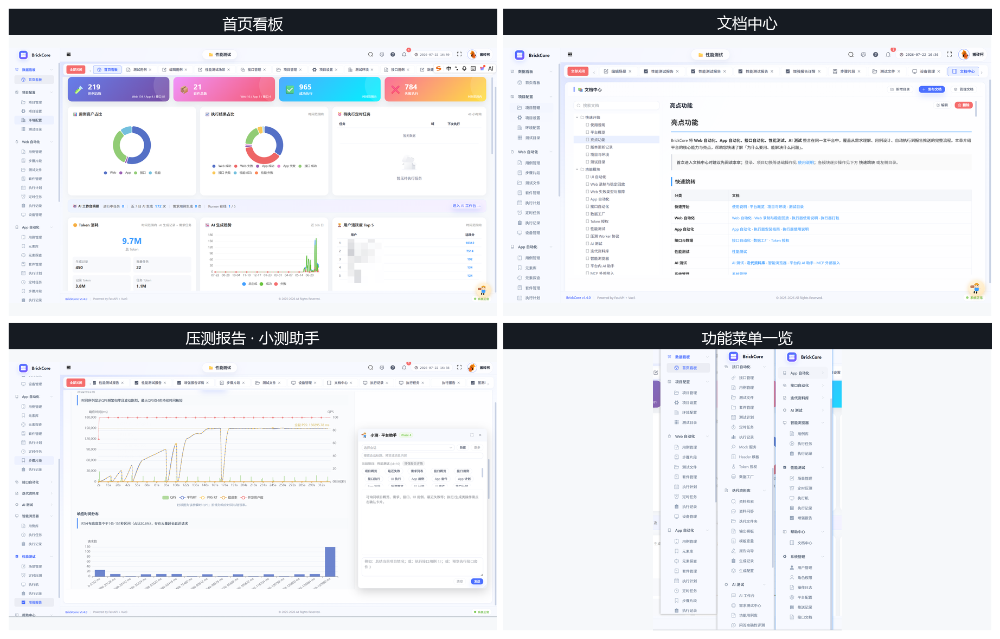
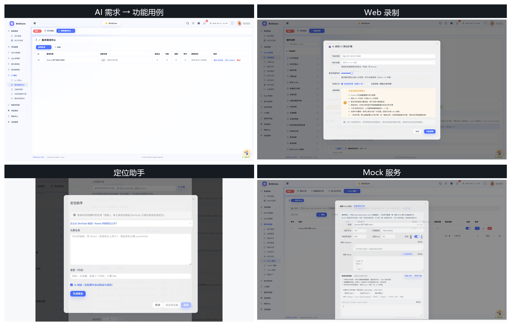

# BrickCore 自动化测试平台

> **当前版本 v1.6.0** · 基于 **FastAPI + Vue3** 的一体化自动化测试平台

覆盖 **Web UI、App、接口、性能、AI** 等测试能力，支持私有化部署、文档中心与执行器网盘分发。平台源码见本仓库；Web / App / 压测执行请配合下方 **BrickCoreRunner** 安装包使用。

## 核心亮点

- **一站式**：Web / App / 接口 / 性能 / AI 测试统一入口，资产与权限集中管理
- **AI 辅助**：需求→功能用例、接口用例生成、失败分析、平台助手「小测」、MCP 外部接入
- **迭代资料库**：文件夹、检索/问答、通用报告向导与 Embedding（可选）
- **录制与自愈**：Web 录制回放、交互调试、定位器自愈，降低脚本维护成本
- **可私有化**：源码可自建；内置文档中心，上手成本低
- **执行方便**：桌面执行器网盘分发，支持 Windows / macOS；压测可选用精简 Worker

---

## 在线演示

| 项 | 内容 |
|----|------|
| **演示地址** | **http://180.76.142.97/** |
| **文档（免登录）** | [http://180.76.142.97/showcase/docs/](http://180.76.142.97/showcase/docs/) |
| **产品演示页** | [http://180.76.142.97/showcase/](http://180.76.142.97/showcase/) |
| 登录账号 | `admin` |
| 登录密码 | `BrickCore123456` |

> 演示环境密码公开，请勿存放真实业务数据；自建部署后请修改密码。  
> **Web 自动化** 与 **录制** 需安装下方执行器；**App 真机执行** 需 Runner 勾选 **App 自动化**。

---

## 功能概览

| 模块 | 说明 |
|------|------|
| **Web 自动化** | 用例/套件/计划、录制回放、步骤片段、测试文件库、定位器自愈 / 定位助手、定时任务、HTML 报告 |
| **App 自动化** | 用例/元素库/元素探查/套件/计划/定时任务/片段；真机调度需 Runner 勾选 **App 自动化** |
| **接口自动化** | Swagger/Postman 导入、测试计划、WebSocket、数据工厂、Mock（同路径多场景）、定时执行 |
| **性能测试** | 流式/SSE 阶段、业务链路、CSV 参数化、分布式 Worker、HTML 报告 |
| **AI 测试** | 需求→功能用例、智能浏览器、失败分析、平台助手「小测」、MCP 外部接入、**迭代资料库** |
| **平台能力** | 统一测试目录、数据看板、RBAC、文档中心、邮件/钉钉/企微通知 |

> **定制文档** 页签已预留；行业定制方案/报告等需联系管理员开通定制开发，默认不可生成下载。

详细说明见 [docs-site/](docs-site/) 或演示站 [文档中心](http://180.76.142.97/showcase/docs/)。

### 界面预览

演示环境拼图（左上→右下）：首页看板、文档中心、压测报告·小测、功能菜单。更多录屏见下方演示站。



### 亮点功能

拼图（左上→右下）：AI 需求→用例、Web 录制、定位助手、Mock 服务。



## 功能演示

功能录屏与完整说明见**在线演示站**（大体积视频不进开源仓）：

| 入口 | 链接 |
|------|------|
| **产品功能演示** | [http://180.76.142.97/showcase/](http://180.76.142.97/showcase/) |
| **使用说明（文档）** | [http://180.76.142.97/showcase/docs/](http://180.76.142.97/showcase/docs/) |

| 亮点 | 说明 |
|------|------|
| AI 需求 → 功能用例 | 上传 PRD，AI 批量生成，禅道 / XMind / 导出 |
| **智能浏览器** | 自然语言驱动浏览器探索（演示页含录屏） |
| Web 录制 + 定位器自愈 / 定位助手 | MCP/助手录制；自愈与 DevTools 定位辅助 |
| 接口 AI 生成 · Mock | 基于 Swagger 生成用例；Mock 同路径多场景 |
| **App 自动化** | 元素探查、用例/计划/片段；真机执行需 App Runner |

---

## 执行器下载（BrickCoreRunner）

**Web 录制、UI 执行、App 真机、分布式压测 Worker** 需安装 **BrickCoreRunner** 客户端（建议 **v1.6.1**，引擎 **1.6.1**）。

**百度网盘**（提取码 **`9gbi`**）：

| 系统 | 安装包 | 说明 |
|------|--------|------|
| **Windows** | `BrickCoreRunner.zip` | 桌面客户端，`BrickCoreRunner.exe` |
| **macOS · Apple 芯片** | `BrickCoreRunner-mac-arm64.zip` | M 系列，`uname -m` → `arm64` |
| **macOS · Intel** | `BrickCoreRunner-mac-intel.zip` | Intel，`uname -m` → `x86_64` |

👉 [百度网盘下载](https://pan.baidu.com/s/1pObFpG-Mt7-Pxo58hklOlg?pwd=9gbi)

| 方式 | 说明 |
|------|------|
| **演示平台内** | 登录演示站 → **Web 自动化 → 设备管理** → **网盘下载** |

**Windows 简要步骤：**

1. 下载解压 `BrickCoreRunner.zip`（路径勿含中文/空格）
2. 运行 `BrickCoreRunner.exe`，服务器填 **`http://180.76.142.97`**（自建则填你的平台地址）
3. 登录后点击 **上线**；**设备管理** 确认在线

**macOS：** 在 Mac 本机解压对应芯片包 → `chmod +x connect-mac.sh start-mac.sh` → `./connect-mac.sh` → `./start-mac.sh`

更多说明：[docs-site/guide/runner-client.md](docs-site/guide/runner-client.md) · [执行器获取与发布](docs-site/guide/runner-packaging.md)

> 维护者：更新网盘后请同步本 README，并在 **系统管理 → 执行器发布** 填写相同外链。

---

## Windows 本机部署 / 开发

支持 **不用 Docker**（本机安装 MySQL / Redis / RabbitMQ / MinIO），也支持 Docker 中间件或全栈：

👉 **[docs-site/guide/windows-deploy.md](docs-site/guide/windows-deploy.md)**

---

## Linux 服务器 Docker 部署（自建）

**首次部署请跟完整文档：**

👉 **[docs-site/guide/docker-deploy.md](docs-site/guide/docker-deploy.md)**（腾讯云 CVM + OpenCloudOS 9 示例）

> 服务器上**只使用**根目录 `docker-compose.yml` 全栈，**不要**再单独起 `docker-services.yml`（会端口冲突）。

### 速查（已完成 Node / Docker 安装后）

```bash
git clone https://gitee.com/BanZhuanKeOrz/BrickCore.git
cd BrickCore
cd frontend && npm install && npm run build && cd ..

# 建议修改 docker-compose.yml 中 MINIO_PUBLIC_ENDPOINT 为你的公网 IP:9200

docker compose up -d --build
docker compose logs -f backend

docker exec -it fastapi_backend aerich upgrade
```

访问 **http://你的公网IP/**，默认 **admin / BrickCore123456**（`database.sql` 初始化后）。

| 用途 | 账号 | 密码 |
|------|------|------|
| 平台 | admin | BrickCore123456 |
| MySQL | admin | BrickCore123456 |

升级至 **v1.6.0** 时务必执行 `aerich upgrade`，并重新构建前端；执行器请同步更新至 **1.6.1**。

---

## 技术栈

| 层级 | 技术 |
|------|------|
| 后端 | FastAPI、Tortoise ORM / Aerich、Pika（MQ） |
| 前端 | Vue 3、Element Plus、Vite |
| 中间件 | MySQL、Redis、RabbitMQ、MinIO |
| 部署 | Docker Compose；Windows 亦可本机中间件 |
| 执行 | BrickCoreRunner（网盘安装包，见上文） |

---

## 文档与版本

| 文档 | 说明 |
|------|------|
| [docs-site/](docs-site/) | 平台使用说明（与登录后「文档中心」内置文档同源） |
| [版本更新记录](docs-site/guide/release-notes.md) | **v1.6.0** 变更与升级指引 |
| [亮点功能](docs-site/guide/highlights.md) | 能力总览与快速跳转 |
| [Docker 部署](docs-site/guide/docker-deploy.md) | 云服务器自建（Linux） |
| [Windows 部署](docs-site/guide/windows-deploy.md) | Windows 本机 Docker / 无 Docker 开发 |

当前公开仓为 **v1.6.0**。通用迭代资料库已开放；定制文档页签预留，需联系管理员开通定制开发。

问题与建议：[Issues](https://gitee.com/BanZhuanKeOrz/BrickCore/issues) 或下方交流群。

---

## 开源协议

本仓库平台源码采用 **[Apache License 2.0](LICENSE)**：可自用、修改与私有化部署；再分发请保留版权与协议声明。

BrickCoreRunner 安装包为配套客户端（网盘 / 平台内下载），使用约定见 [LICENSE-RUNNER.md](LICENSE-RUNNER.md)。

---

## 测试交流群

使用、部署或反馈问题时，欢迎加入 **BrickCoreAI 测试平台交流群**：

<p align="center">
  <br />
  <sub>微信扫码加入 · 交流部署、用例编写与版本动态 · 二维码约 7 天有效（当前至 8 月 29 日前）</sub>
</p>

---

## 支持与交流

- 觉得有用欢迎 **Star** ⭐
- 问题与建议：加入上方交流群，或扫下方微信好友二维码

<p align="center">
  <br />
  <sub>微信好友</sub>
</p>
