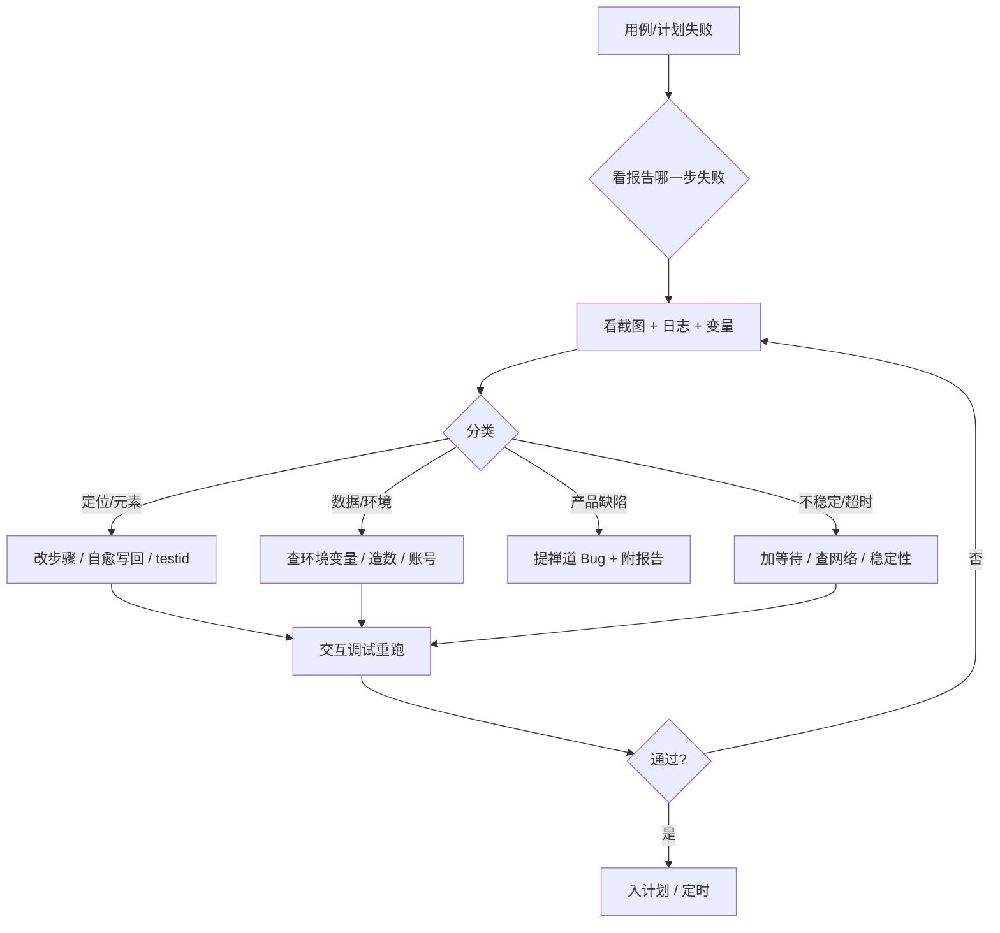

# Web 失败类型与排障

> 配合 [Web 录制与稳定回放用户指南](./web-recording-playback.md) 使用。  
> Runner 安装、MQ、多进程等问题见 [Runner 排查指南](./runner-troubleshooting.md)。

## 1. 排障总流程



---

## 2. 失败类型（8 类）

| 类型 | 典型表现 | 常见原因 | 优先动作 |
|------|----------|----------|----------|
| **1. 元素定位失败** | `Timeout`、找不到元素 | DOM 变更、locator 不准、iframe | 交互调试：操作条 **拾取 / 高亮 / 验证**，或换候选 / 自愈写回 / 协商增加稳定定位属性 |
| **1b. 能点不能填（组件外壳）** | `fill` 报不是 input；resolved 到 `div.el-input` | ElementUI 等点到了外壳 | 新版拾取已下钻；存量改到 `input.el-input__inner` 或语义定位；见下文 §2.1 |
| **1c. 同文案点错按钮** | 点到了另一个「新增」/「确定」 | 页内多匹配、缺 region | 改用 **智能点击** 并填区域；或收紧 locator；见 [Web 自动化](./ui-automation.md) |
| **2. 元素不可操作** | 被遮挡、不可见、disabled | 弹窗未关、loading 未结束 | 前序加 wait / 关弹窗步骤；遮罩可试 **强制点击** |
| **3. 断言失败** | 文本/属性与预期不符 | 产品变更、数据不对 | 核对预期文案；区分缺陷 vs 断言过时 |
| **4. 导航/URL 错误** | 404、跳错页 | Host 配错、登录失效 | 查环境 Host；重跑登录片段 |
| **5. 超时** | 步骤 / 用例总超时 | 接口慢、无头资源不足 | 调大该步 timeout；查 Runner 负载 |
| **6. 数据/变量** | 空值、重复、权限不足 | global_vars 缺失、造数未执行 | 查环境变量、数据工厂 setup |
| **7. 环境/Runner** | 设备离线、浏览器未起 | Runner 掉线、多进程抢 MQ | 设备管理；见 Runner 排查指南 |
| **8. 脚本/库断言** | DB 断言、前后置脚本失败 | SQL 错、连接失败 | 查数据工厂数据源与 SQL |

### 2.1 ElementUI 多 iframe 弹窗：能点不能输 / 上传失败

**场景**：后台壳页多个 iframe（tab、同源嵌入），弹窗在 iframe 内（如 `el-dialog`）。

| 现象 | 原因 | 处理 |
|------|------|------|
| 点击可以，输入报 `fill` 不是 input；resolved 到 `div.el-input` | 点到了 ElementUI 外壳（**旧拾取**常见） | **新版 Runner 拾取**会下钻到真实 `input`；存量请改到 `input.el-input__inner`，或仍用外壳时依赖执行侧 fill 自动下钻。优先选候选里的 `get_by_role=textbox` / placeholder（类似 codegen） |
| 弹窗按钮常规 click 失败 | 遮罩 / 动画未完全可点 | 步骤开 **强制点击**，属常见绕过 |
| iframe 内上传失败 | 点了「上传」按钮、不是 `input[type=file]`、或 `src` 引号不成对 | `input文件上传` + `iframe[src*="/业务路径"]\|\|input[type=file]`；检查引号 |

```text
# 输入
关键字：iframe内元素输入
frame：iframe[src*="/biz/order"]
locator：div.el-dialog input.el-input__inner

# 上传
关键字：input文件上传
locator：iframe[src*="/biz/order"]||input[type=file]

# 引号错误（多一个引号）
错误：iframe[src*="/xxx/index""]||input[type=file]
正确：iframe[src*="/xxx/index"]||input[type=file]
```

录制/拾取对「确定」「取消」等短词可能默认用 CSS（避免同文案点错），与「点到 el-input 外壳」无关。**新版拾取已对普通输入下钻**；仍建议优先语义定位（`get_by_role=textbox` + 顺序索引 / placeholder）。输入失败优先查是否仍停在组件外壳，或 Runner 是否未升级。

用例编辑页折叠指南 **「十四、ElementUI 多 iframe 弹窗」** 有更完整示例。

---

## 3. 决策树：改步骤 vs 找研发

```
失败步是「找不到 / 点不到元素」？
├─ 是 → 页面是否刚改版？
│   ├─ 是 → 自愈写回或手改 locator；仍不稳 → 提研发加 data-testid
│   └─ 否 → 是否偶发？
│       ├─ 是 → 加 wait、查环境、看是否并发脏数据
│       └─ 否 → 交互调试单步复现 → 改 locator
└─ 否 → 断言内容是否与产品一致？
    ├─ 否 → 更新断言
    └─ 是 → 按功能缺陷提 Bug（附报告链接、截图）
```

---

## 4. 按场景的快捷处理

### 4.1 登录态丢失

| 现象 | 处理 |
|------|------|
| 套件第 2 个用例起跳登录页 | 登录做成 **步骤片段** 挂套件前置；或合并到同一用例 |
| 录制时登录录不上 | 录制窗口内 **手动登录** 再录业务；勿假设「魔法跳过登录」 |
| Cookie 域不一致 | 检查环境 Host 与录制 URL 是否同域 |

### 4.2 下拉 / 列表 option 超时

| 现象 | 处理 |
|------|------|
| 日志 Heal 成功但 click 仍 30s 超时 | 可能匹配到 **不可见** 的 `nth(N)` option；手改定位限定下拉容器 |
| 菜单未展开就点 option | 前序加 click 展开；或加长 wait |

### 4.3 自愈 / AI Act 很慢

| 现象 | 处理 |
|------|------|
| 单步 1～2 分钟 | 正常：Heal LLM + 重试 + Act；调试可 **关 Act** |
| Heal 日志成功仍失败 | 见 §4.2；报告区分 Heal 返回 vs 重试结果 |
| 长期 CI 不应依赖 Act | 失败后 **写回用例** 或人工改步 |

### 4.4 SPA / 动态加载

- 步骤间加 **等待** 或 **等待元素**
- 交互调试确认 DOM 稳定后再录下一段
- 避免在 skeleton 占位元素上录 click

### 4.5 图像定位失败

- viewport 与录模板时 **不一致**
- 模板图过小/过大；重新截模板上传

### 4.6 停止执行不生效 / 假超时（v1.6）

| 现象 | 处理 |
|------|------|
| 点停止后仍跑很久、甚至继续下一步 | 确认 Runner 已升到含 **取消加固** 的引擎包（平台建议 **1.1.2**）；旧包成功步截图可能吞掉取消 |
| 输入 / 拖拽 / 等待接口约 **0.5s** 就超时 | 旧包禁重试路径误用 500ms 分片；升级后应跑满步骤超时 |
| 失败码 `ACTION_TIMEOUT` / `READY_TIMEOUT` / `BUSY_TIMEOUT` / `STEP_BUDGET_EXHAUSTED` | 属超时类；**不会**再做用例级整例重跑（避免空耗） |
| 失败码 `CANCELLED` | 用户或平台停止；属预期，非定位错误 |
| 停止时正执行 `execute_js` / 裸鼠标 / 读大响应体 | Sync API 限制，可能短阻至页面关闭；属已知边界 |

---

## 5. 报告页工具

| 工具 | 何时用 |
|------|--------|
| **交互调试** | 报告失败步可跳转编辑页试跑；支持调试浏览器内操作条（拾取 / 高亮 / 验证 / 按步执行） |
| **AI 失败分析** | 需要根因归纳、修复建议 |
| **写回自愈 / Act** | 确认新 locator 有效后固化 |
| **批量 AI 分析** | 计划级多个失败快速浏览 |

分析质量依赖：失败步截图、前后步骤截图、Runner 日志（后续版本会增强上下文）。

---

## 6. 常见问题 FAQ

**Q：同环境两个套件一过一个挂？**  
A：多为 **多个 Runner 进程** 抢同一 device_id，见 [Runner 排查指南 §二](./runner-troubleshooting.md#二同一-runner-套件一成功一失败)。

**Q：定时任务没跑？**  
A：任务是否启用、计划与环境是否正确；首页看板 **待执行定时任务**。

**Q：录制定位总不准？**  
A：录前看 Runner 蓝框高亮；低质量步骤手调；关键按钮推动研发 **data-testid**。

**Q：ElementUI 弹窗在 iframe 里能点不能输？**  
A：旧拾取易停在 `div.el-input` 外壳；**新版 Runner 拾取已下钻**，候选含 `get_by_role=textbox` 等。存量改到 `input.el-input__inner` 或语义定位，或升级 Runner 后依赖 fill 外壳自动下钻。见上文 [§2.1](#21-elementui-多-iframe-弹窗能点不能输--上传失败)。

**Q：和接口失败怎么区分？**  
A：Web 报告看 **步骤时间轴**；接口看 **请求/响应** Tab。UI 套件 env 里可能出现接口相关 **变量名**（共用 global_vars），非接口用例混入。

**Q：失败后直接改生产数据？**  
A：禁止。用测试环境 + 数据工厂造数；库断言只读校验。

**Q：点了停止还在跑 / 输入刚开就超时？（v1.6）**  
A：见上文 [§4.6](#46-停止执行不生效--假超时v16)；升级含取消加固的 Runner 后再试。

---

## 7. 相关文档

- [Web 录制与稳定回放用户指南](./web-recording-playback.md)
- [Web 自动化](./ui-automation.md)
- [Runner 排查指南](./runner-troubleshooting.md)
